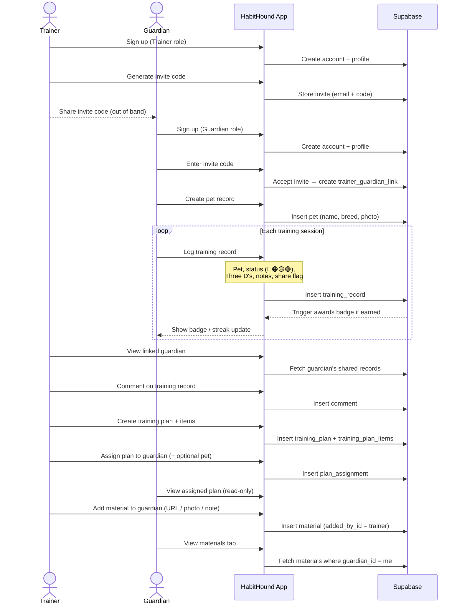

# Habit Hound

A pet training tracker that bridges the gap between trainer visits. Guardians log sessions and track progress; Trainers deliver plans, review records, and leave feedback.

## Roles

| Role | What they do |
|---|---|
| **Guardian** | Logs training sessions, manages pets, earns badges, views trainer plans |
| **Trainer** | Invites guardians, creates training plans, reviews shared records, adds materials |

## Stack

- **iOS** — SwiftUI, iOS 17+, `@Observable`
- **Backend** — Supabase (PostgreSQL + Auth + Storage)
- **Auth** — Email/password + Sign in with Apple
- **Notifications** — Local only

## Build & Run

```bash
make build   # build for simulator
make run     # build, install, and launch on simulator
```

> Requires `Secrets.xcconfig` at the project root (gitignored). Copy from a teammate or the project 1Password vault.

## Implementation Plan

See [`docs/mvp_plan.md`](docs/mvp_plan.md) for the full 12-phase execution plan and database schema.

## Sequence Diagram


