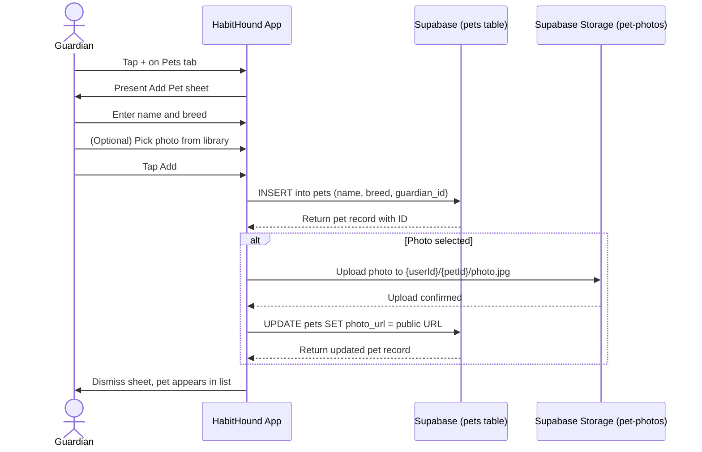
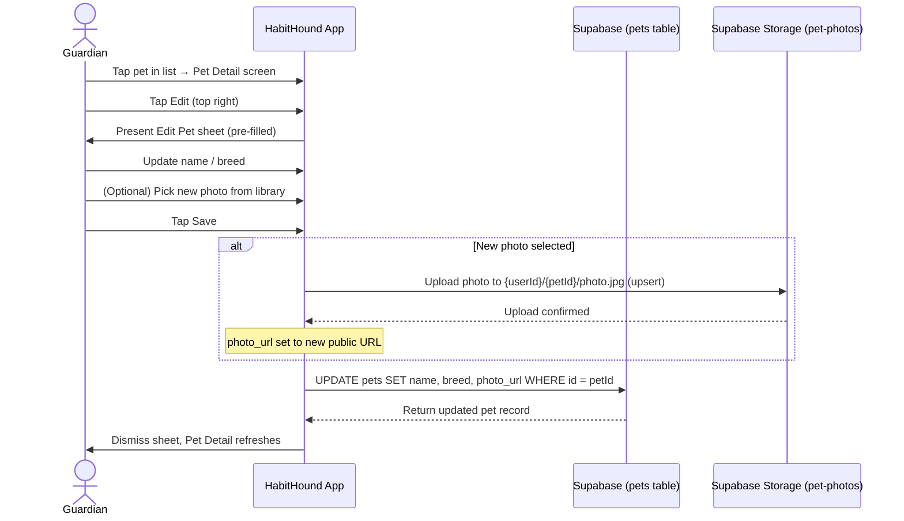
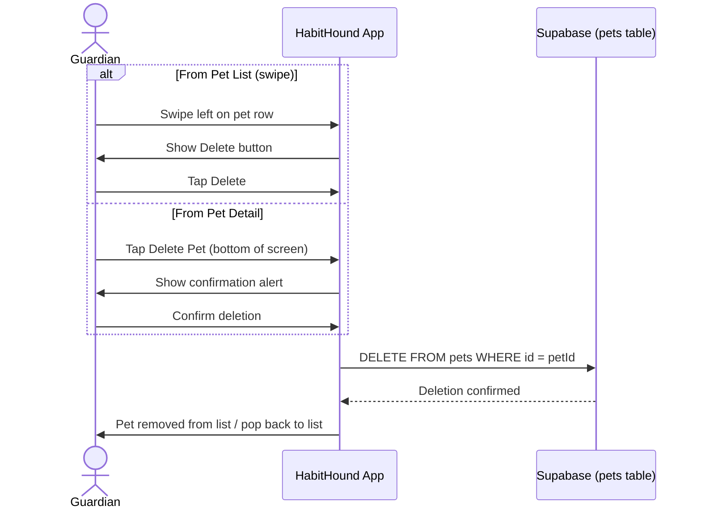

# Use Cases — Pet Management

## 1. Create Pet (with optional photo)

```mermaid
sequenceDiagram
    actor G as Guardian
    participant App as HabitHound App
    participant DB as Supabase (pets table)
    participant S as Supabase Storage (pet-photos)

    G->>App: Tap + on Pets tab
    App->>G: Present Add Pet sheet
    G->>App: Enter name and breed
    G->>App: (Optional) Pick photo from library
    G->>App: Tap Add

    App->>DB: INSERT into pets (name, breed, guardian_id)
    DB-->>App: Return pet record with ID

    alt Photo selected
        App->>S: Upload photo to {userId}/{petId}/photo.jpg
        S-->>App: Upload confirmed
        App->>DB: UPDATE pets SET photo_url = public URL
        DB-->>App: Return updated pet record
    end

    App->>G: Dismiss sheet, pet appears in list
```

## 2. Edit Pet (update name, breed, or photo)

```mermaid
sequenceDiagram
    actor G as Guardian
    participant App as HabitHound App
    participant DB as Supabase (pets table)
    participant S as Supabase Storage (pet-photos)

    G->>App: Tap pet in list → Pet Detail screen
    G->>App: Tap Edit (top right)
    App->>G: Present Edit Pet sheet (pre-filled)

    G->>App: Update name / breed
    G->>App: (Optional) Pick new photo from library
    G->>App: Tap Save

    alt New photo selected
        App->>S: Upload photo to {userId}/{petId}/photo.jpg (upsert)
        S-->>App: Upload confirmed
        Note over App: photo_url set to new public URL
    end

    App->>DB: UPDATE pets SET name, breed, photo_url WHERE id = petId
    DB-->>App: Return updated pet record

    App->>G: Dismiss sheet, Pet Detail refreshes
```

## 3. Delete Pet

```mermaid
sequenceDiagram
    actor G as Guardian
    participant App as HabitHound App
    participant DB as Supabase (pets table)

    alt From Pet List (swipe)
        G->>App: Swipe left on pet row
        App->>G: Show Delete button
        G->>App: Tap Delete
    else From Pet Detail
        G->>App: Tap Delete Pet (bottom of screen)
        App->>G: Show confirmation alert
        G->>App: Confirm deletion
    end

    App->>DB: DELETE FROM pets WHERE id = petId
    DB-->>App: Deletion confirmed

    App->>G: Pet removed from list / pop back to list
```
