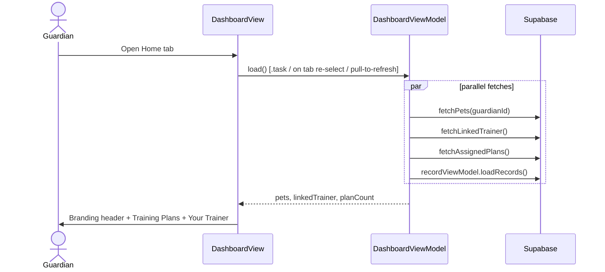

# Use Case: Guardian Dashboard

The guardian's **Home** tab. A light landing screen — app branding, a count of assigned plans, and the linked trainer.

> **Removed — streak & badges.** Earlier builds had a daily-streak counter and an
> achievements/badges system on this screen (the old "Dashboard & Badges" phase).
> Both were removed **front-to-back**: `AchievementsView`, `Badge`, `BadgeService`,
> `StreakTests`, and the badge/streak code in `DashboardViewModel` are deleted, and
> the backend `badges` table + the `award_badges()` triggers were dropped. See the
> "Dashboard cleanup + app-branding headers" card.

## UC-D.1 View the Dashboard

**Actor:** Guardian
**Precondition:** Guardian is authenticated; the Home tab is selected.

## Layout

`DashboardView` is a `VStack` of an `AppBrandingHeader` over a `List`. The navigation bar is hidden (`.toolbar(.hidden, for: .navigationBar)`) — the branding header *is* the screen header.

1. **`AppBrandingHeader`** — the app icon (`SplashLogo` asset) + the name **"Hound Habit"**. No "Home" title.
2. **Training Plans** section — `"N plans assigned"` as a tappable row that switches to the Plans tab (via the `switchToPlansTab` closure passed from `GuardianTabView`); `"No plans assigned yet."` when the count is zero.
3. **Your Trainer** section — the linked trainer's name + link date, or `"No trainer linked yet."`.

`DashboardViewModel.load()` runs the fetches in parallel and is re-run on `.task`, on Home-tab re-selection (`GuardianTabView.onChange(of: selectedTab)`), and on pull-to-refresh.

## AppBrandingHeader (shared component)

`Shared/Components/AppBrandingHeader.swift` — the Hound Habit icon + name, with an optional `subtitle`. Used in two places:

- **Guardian dashboard** — no subtitle (replaces the old "Home" nav title).
- **Trainer Guardians page** (`GuardianListView`) — `subtitle: "Guardians"`, rendered smaller (`.title2`, secondary) beneath the brand line. The trainer page also hides its nav bar so the branding header is the screen header.

## Test Flow

### T-D.1 Dashboard content
1. Sign in as a guardian → Home tab.
2. Confirm the header is the **app icon + "Hound Habit"** — no "Home" title, no streak row, no achievements section.
3. Confirm only **Training Plans** and **Your Trainer** sections are shown.
4. With ≥ 1 assigned plan → "N plans assigned" is tappable → switches to the Plans tab.
5. With a linked trainer → the trainer's name + link date show; otherwise "No trainer linked yet."
6. Pull to refresh → the sections reload.

### T-D.2 Trainer Guardians header
1. Sign in as a trainer → Guardians tab.
2. Confirm the header is the **app icon + "Hound Habit"** with a smaller **"Guardians"** label beneath it.
3. Tapping a guardian still pushes `GuardianDetailView` normally.
