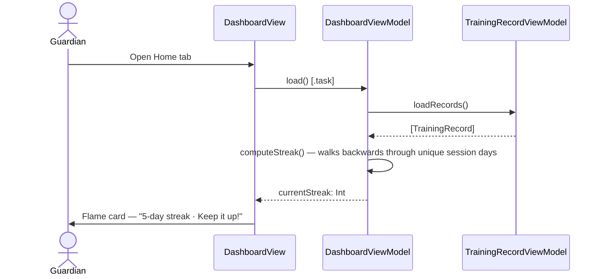
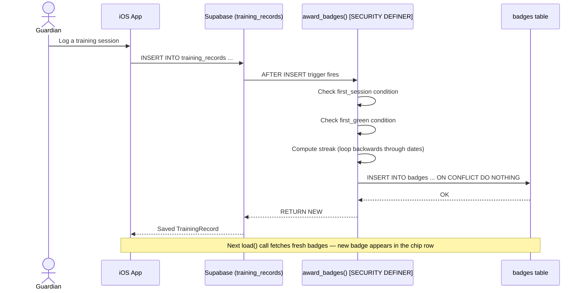
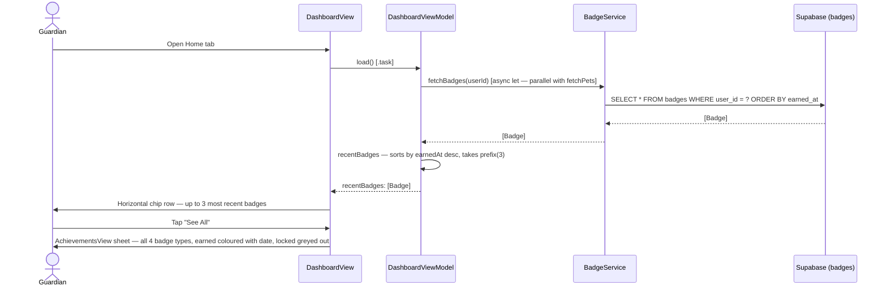

# Use Case: Dashboard & Badges (Phase 5)

## UC-5.1 View Streak on Home Tab

The **Home** tab shows a flame icon and the guardian's current training streak — the number of consecutive calendar days on which at least one session was logged.  Streak is computed client-side inside `DashboardViewModel.computeStreak()` from the already-loaded records array; no extra network call is needed.

**Streak rules**
- If a session exists for today → streak starts today and walks backwards.
- If no session today but one exists yesterday → streak starts yesterday (allows for sessions not yet logged today).
- Any gap of ≥ 2 days resets the count to 0.



---

## UC-5.2 Earn a Badge

Badges are awarded automatically by a Postgres `SECURITY DEFINER` trigger (`award_badges_on_insert`) that fires **after every INSERT** on `training_records`.  The app never writes to `badges` directly — RLS allows only SELECT on own rows.

| Badge | Trigger condition |
|---|---|
| **First Step** (`first_session`) | `COUNT(training_records WHERE guardian_id = NEW.guardian_id) = 1` |
| **Green Light** (`first_green`) | `NEW.status = 'green'` |
| **Week Warrior** (`7_day_streak`) | Streak of consecutive days ≥ 7 at insert time |
| **Monthly Master** (`30_day_streak`) | Streak of consecutive days ≥ 30 at insert time |

`ON CONFLICT (user_id, badge_type) DO NOTHING` ensures each badge is awarded at most once per guardian.



---

## UC-5.3 View Earned Badges on Home Tab

The Home tab Achievements section shows a horizontal scroll row of the **3 most recently earned** badge chips (sorted by `earnedAt` descending, via `DashboardViewModel.recentBadges`). A **See All** button opens `AchievementsView` as a sheet showing the full gallery. If no badges have been earned, the section shows an encouraging empty-state message instead of hiding.

> **Per-pet achievements**: Badges are currently per-user (not per-pet). A future enhancement may group or filter badges by pet for households with multiple pets.



---

## UC-5.4 View All Achievements

Guardian taps **See All** in the Achievements section header → `AchievementsView` sheet.

- All 4 badge types are always shown (locked or earned).
- Earned badges show their icon in full colour + "Earned Mar 19, 2026".
- Locked badges show the icon in tertiary grey with no date.

---

## Architecture Notes

### Why streak is client-side, badges are server-side

| Concern | Streak | Badges |
|---|---|---|
| **Tamper resistance** | Low — display only | High — must not be self-awarded |
| **Data needed** | Already loaded records | Requires AFTER INSERT hook |
| **Latency** | Zero (computed in memory) | Async but one extra parallel fetch |

### `SECURITY DEFINER` on `award_badges()`

The function runs with the privileges of its **owner** (the `postgres` role), not the calling guardian. This lets it INSERT into `badges` even though the guardian's RLS policy has no INSERT permission — making badge awards tamper-proof from the client.

### What is a SECURITY DEFINER?
A normal Postgres function runs with the permissions of whoever calls it (the logged-in user). SECURITY DEFINER flips this — the function runs with the permissions of whoever created it (the postgres superuser role).

#### Why it matters here:

The guardian's RLS policy on badges only allows SELECT. There is no INSERT policy for guardians — by design, so a client can't award themselves badges. When the trigger fires after an INSERT on training_records, it's technically running in the context of the guardian's session. Without SECURITY DEFINER, the trigger's attempt to INSERT into badges would be blocked by RLS.

With SECURITY DEFINER, the function temporarily elevates to postgres permissions, does the INSERT, then drops back. The guardian never had INSERT access — they just logged a training session and the database took care of the rest. It's the same pattern iOS apps use for server-side business logic: the client is untrusted, so the sensitive write happens inside the database where the client can't interfere.

### Parallel loading in `DashboardViewModel.load()`

```swift
async let fetchedPets   = petService.fetchPets(guardianId: userId)
async let fetchedBadges = badgeService.fetchBadges(userId: userId)
await recordViewModel.loadRecords()          // serial — has its own internal state
pets   = try await fetchedPets
badges = (try? await fetchedBadges) ?? []    // badge fetch failure is non-fatal
currentStreak = computeStreak()
```

Pets and badges are fetched concurrently.  Badge failure is swallowed (`try?`) so a permissions misconfiguration never breaks the main feed.

---

## Test Flow

### T-5.1 Streak counter — zero state
1. Sign in as a guardian with no sessions logged today or yesterday.
2. Open the **Home** tab.
3. Confirm the streak card shows "0-day streak" with a grey flame and "Log a session to start your streak!".

### T-5.2 Streak counter — active streak
1. Log a session with today's date.
2. Reload the Home tab (pull-to-refresh or switch tabs and return).
3. Confirm the flame is orange and the counter shows "1-day streak".
4. In Supabase, manually insert a `training_records` row for yesterday with the same `guardian_id`.
5. Reload — confirm the counter shows "2-day streak".

### T-5.3 First Step badge
1. Sign in as a brand-new guardian with no prior records.
2. Log one session.
3. In Supabase → `badges`: confirm a `first_session` row exists for this user.
4. Reload Home tab — confirm the badge chip appears in the Achievements row.

### T-5.4 Green Light badge
1. Log a session with **Green** status.
2. In Supabase → `badges`: confirm a `first_green` row exists.
3. Reload — confirm the chip appears.

### T-5.5 Idempotency
1. Log a second session with Green status.
2. Confirm Supabase still has exactly **one** `first_green` badge row (no duplicates — `ON CONFLICT DO NOTHING`).

### T-5.6 See All — AchievementsView
1. Have at least one badge earned.
2. Tap **See All** in the Achievements header.
3. Confirm the sheet shows all 4 badge types.
4. Earned badges: coloured icon + "Earned [date]".
5. Unearned badges: grey icon, no date.
6. Tap **Done** — sheet dismisses.

### T-5.7 Empty Achievements section
1. Sign in as a guardian with no badges earned.
2. Confirm the Achievements section **is shown** with the message "Log your first session to earn a badge!" (section is always visible).

---

## Dashboard Layout (as of Phase 5)

| Section | Content | Phase filled |
|---------|---------|-------------|
| Streak | Flame icon + day count | Phase 5 ✓ |
| Achievements | Up to 3 recent badge chips; empty state if none | Phase 5 ✓ |
| From Your Trainer | Trainer comments on sessions | Phase 8 |
| Your Trainer | Linked trainer name + contact | Phase 7 |

**Guardian tabs**: Home · Pets · Plans · Settings. There is no standalone Log tab — sessions are logged from the Pets tab (Pet Detail → Training Sessions → +) or via the Plans tab (Practice This Step flow).
