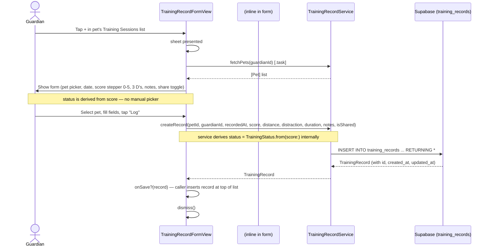
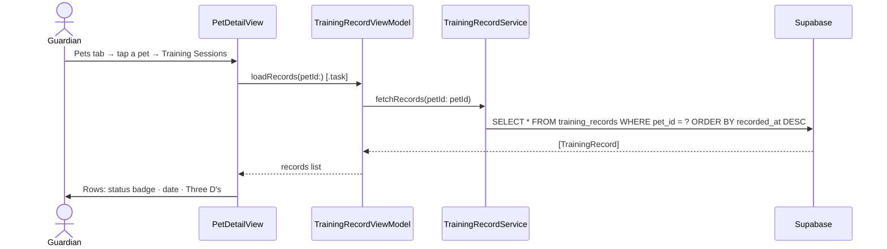
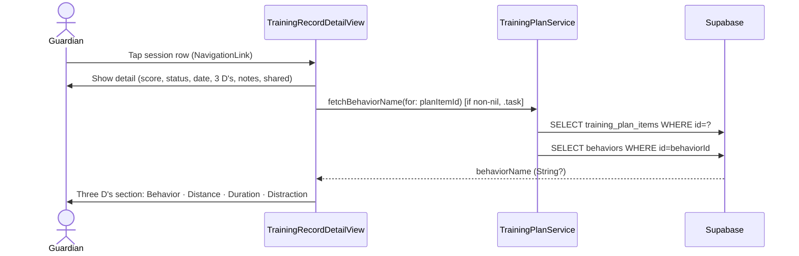
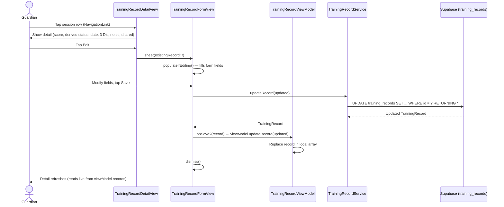
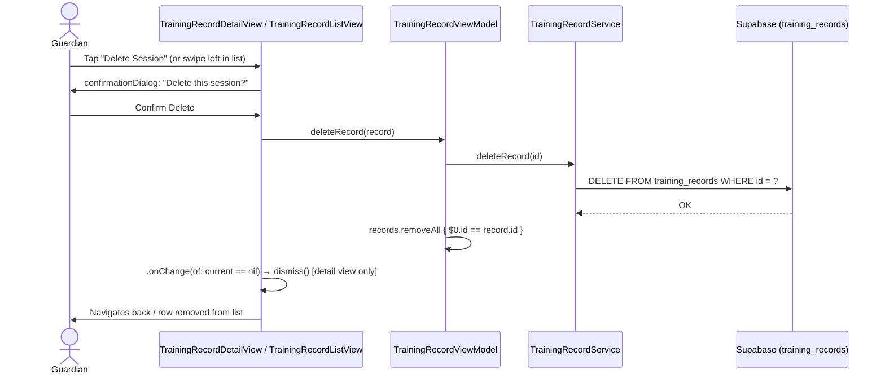

# Use Case: Training Record Logging (Phase 4)

## UC-4.1 Log a Training Session

Guardian taps the **+** button inside a pet's training sessions list, fills in the form, and saves. The record is persisted to Supabase and appears in the list immediately. Sessions can also be logged via the Plans flow (see UC-9.6).

There is no standalone Log tab — all standalone session logging is accessed from the Pets tab (Pet Detail → Training Sessions → +).

---

## UC-4.2 View Training Sessions List

Guardian views sessions from the **Pet Detail** view — `TrainingRecordListView` loads records filtered to that pet.

---

## UC-4.3 View a Training Session Detail

Guardian taps a session row. For plan-linked sessions (`planItemId` non-nil), the detail view self-loads the behavior name and shows it in the Three D's section.

Standalone sessions (`planItemId` nil) show no Behavior row.

The sharing section (Share with Trainer toggle / "Shared with Trainer" label) is hidden entirely for plan-linked sessions — sharing is controlled once at the plan level via `GuardianPlanDetailView` and inherited by all sessions logged under that plan.

---

## UC-4.3b Edit a Training Session

Guardian taps a session row → detail view → taps **Edit**.

---

## UC-4.4 Delete a Training Session

Guardian can delete from the detail view (button + confirmation dialog) or via swipe-to-delete in the list.

---

## Test Flow

### T-4.1 Log a new session
1. Build and run the app.
2. Go to **Pets** tab → tap a pet → tap **Training Sessions** → tap **+** in the toolbar.
3. Confirm the pet is pre-selected in the picker.
4. Confirm the **Reps out of 5** stepper is shown (not a manual status picker) — the derived status (coloured circle + label) should update live as you adjust the score.
5. Set score to 5 — confirm status shows Green. Set score to 1 — confirm status shows Red.
6. Set distance / distraction / duration.
7. Scroll down — confirm a **Notes** text field and a **Share with Trainer** toggle are visible at the bottom of the form. (The toggle is hidden for plan-linked sessions — sharing is controlled at the plan level.)
8. Tap **Log** — sheet should dismiss and the new session should appear immediately at the top of this pet's sessions list.
9. In Supabase → Table Editor → `training_records`: confirm a new row appears with the correct `pet_id`, `guardian_id`, `score`, and `status` (derived) field values. `plan_item_id` should be `null` for a standalone session.

### T-4.2 View sessions — per pet
1. Go to **Pets** tab → tap a pet → tap **Training Sessions**.
2. Confirm only sessions for that pet are shown (no other pets' sessions visible).
3. Confirm the row shows: status badge, date/time, distance · distraction · duration.

### T-4.3b Empty state
1. Add a second pet with no sessions.
2. Go to **Pets** → tap that pet → **Training Sessions**.
3. Confirm the "No Sessions Yet" empty state appears.

### T-4.3 View a plan-linked session detail
1. Complete a plan step (UC-9.6) to create a plan-linked session.
2. Go to **Pets** tab → tap the pet → **Training Sessions** → tap the session row.
3. Confirm the **Three D's** section shows a **Behavior** row at the top (e.g. "Behavior: Leave It") above Distance, Duration, Distraction.
4. Open a standalone session (no plan context) — confirm no Behavior row is shown.

### T-4.4 Edit a session
1. Tap a session row to open the detail view.
2. Confirm all fields display correctly.
3. Tap **Edit** — the Edit Session sheet should appear with all fields pre-populated, including the score stepper.
4. Change the score (e.g. 5 → 3) and tap **Save** — the derived status should update (Green → Yellow).
5. Confirm the detail view reflects the updated score and status immediately (no reload required).
6. Confirm the Supabase row is updated.

### T-4.5 Delete from detail view
1. Open a session's detail view (from either the Home tab feed or a pet's sessions list).
2. Tap **Delete Session** — confirm a confirmation dialog appears ("Delete this session?").
3. Tap **Delete** — view should dismiss and the row should be gone from the originating list.
4. Confirm the Supabase row is deleted.

### T-4.6 Delete via swipe
Swipe-to-delete is available in both the **Home** tab feed and a pet's **Training Sessions** list.
1. In either list, swipe left on a row.
2. Tap **Delete** — row should be removed without a confirmation dialog.
3. Confirm the Supabase row is deleted.

### T-4.7 Log from Pet Detail (pre-selected pet)
1. Go to **Pets** → tap a pet → **Training Sessions** → tap **+** (toolbar).
2. Confirm the pet picker pre-selects the correct pet.
3. Log the session and confirm it appears in both this pet's list and the **Home** tab feed.
