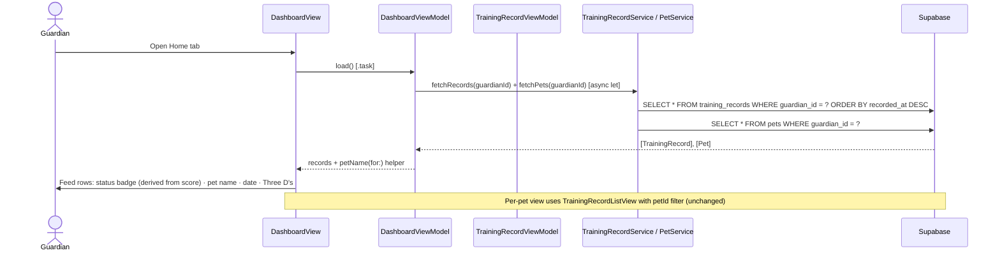
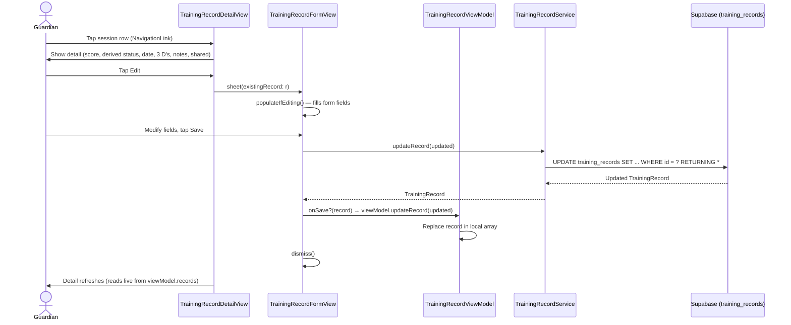
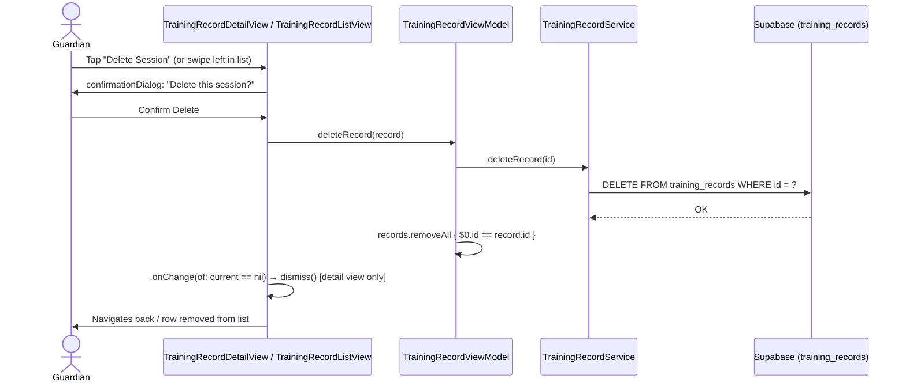

# Use Case: Training Record Logging (Phase 4)

## UC-4.1 Log a Training Session

Guardian taps the **Log** tab (centre tab) or the **+** button inside a pet's sessions list, fills in the form, and saves. The record is persisted to Supabase and appears in the list immediately.

---

## UC-4.2 View Training Sessions List

Guardian views sessions in two contexts:
- **Home tab (all pets)** — `DashboardView` loads all records via `DashboardViewModel`, showing pet name + date + Three D's per row.
- **Pet Detail (filtered)** — `TrainingRecordListView` loads records for a single pet.

---

## UC-4.3 Edit a Training Session

Guardian taps a session row → detail view → taps **Edit**.

---

## UC-4.4 Delete a Training Session

Guardian can delete from the detail view (button + confirmation dialog) or via swipe-to-delete in the list.

---

## Test Flow

### T-4.1 Log a new session
1. Build and run the app.
2. Tap the **Log** tab (centre, plus icon) — the Log Session sheet should appear.
3. Confirm the pet picker is populated with your existing pets.
4. Select a pet, leave the date as now. Confirm the **Reps out of 5** stepper is shown (not a manual status picker) — the derived status (coloured circle + label) should update live as you adjust the score.
5. Set score to 5 — confirm status shows Green. Set score to 1 — confirm status shows Red.
6. Set distance / distraction / duration.
7. Scroll down — confirm a **Notes** text field and a **Share with Trainer** toggle are visible at the bottom of the form.
8. Tap **Log** — sheet should dismiss and the new session should appear immediately at the top of the **Home** tab feed (no tab-switching required).
9. In Supabase → Table Editor → `training_records`: confirm a new row appears with the correct `pet_id`, `guardian_id`, `score`, and `status` (derived) field values. `plan_item_id` should be `null` for a standalone session.

### T-4.2 View sessions — Home tab (all pets)
1. Go to the **Home** tab.
2. Confirm the session logged in T-4.1 appears at the top of the feed.
3. Confirm each row shows: status badge, pet name, date, distance · distraction · duration.
4. Tap a row — confirm it navigates to the detail view.

### T-4.3 View sessions — per pet
1. Go to **Pets** tab → tap a pet → tap **Training Sessions**.
2. Confirm only sessions for that pet are shown (no other pets' sessions visible).
3. Confirm the row shows: status badge, date/time, distance · distraction · duration.

### T-4.3b Empty state
1. Add a second pet with no sessions.
2. Go to **Pets** → tap that pet → **Training Sessions**.
3. Confirm the "No Sessions Yet" empty state appears.

### T-4.4 Edit a session
1. Tap a session row to open the detail view.
2. Confirm all fields display correctly.
3. Tap **Edit** — the Edit Session sheet should appear with all fields pre-populated, including the score stepper.
4. Change the score (e.g. 5 → 3) and tap **Save** — the derived status should update (Green → Yellow).
5. Confirm the detail view reflects the updated score and status immediately (no reload required).
6. Confirm the Supabase row is updated.

### T-4.5 Delete from detail view
1. Open a session's detail view (from either the Home tab feed or a pet's sessions list).
2. Tap **Delete Session** — confirm a confirmation dialog appears ("Delete this session?").
3. Tap **Delete** — view should dismiss and the row should be gone from the originating list.
4. Confirm the Supabase row is deleted.

### T-4.6 Delete via swipe
Swipe-to-delete is available in both the **Home** tab feed and a pet's **Training Sessions** list.
1. In either list, swipe left on a row.
2. Tap **Delete** — row should be removed without a confirmation dialog.
3. Confirm the Supabase row is deleted.

### T-4.7 Log from Pet Detail (pre-selected pet)
1. Go to **Pets** → tap a pet → **Training Sessions** → tap **+** (toolbar).
2. Confirm the pet picker pre-selects the correct pet.
3. Log the session and confirm it appears in both this pet's list and the **Home** tab feed.
