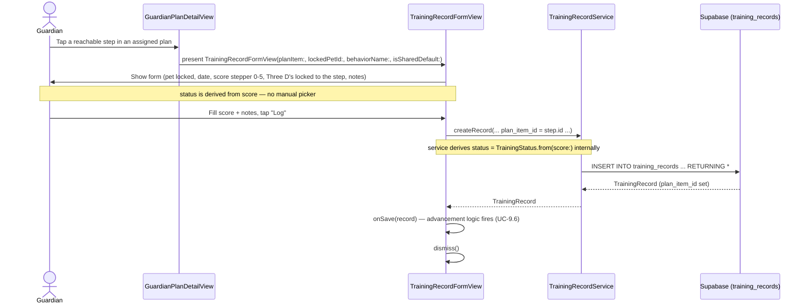
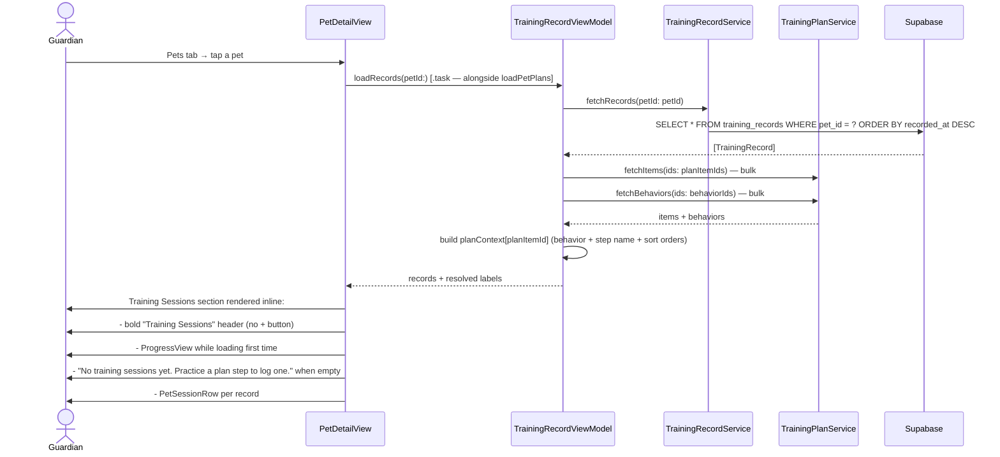
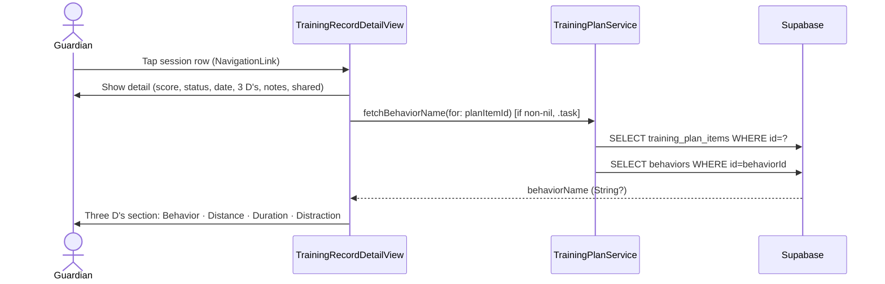
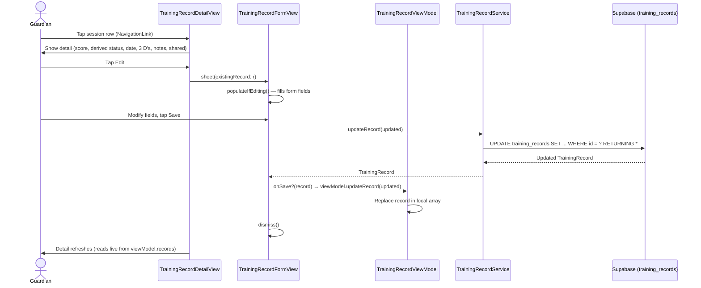
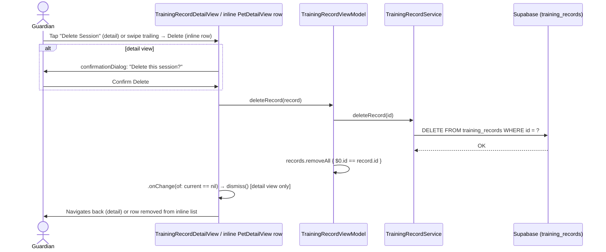

# Use Case: Training Record Logging (Phase 4)

## UC-4.1 Log a Training Session

**Every training session is plan-linked (IOS-31).** Guardians can only log a session by practising a step inside an assigned plan — there is **no standalone session logging**. There is no Log tab, no standalone sessions list screen, and no `+` affordance in the Pet detail's Training Sessions section. A session is created from the practice flow in `GuardianPlanDetailView` (see UC-9.6), which always sets `plan_item_id`.

> **Removed — standalone session logging (IOS-31).** An earlier build let guardians
> log standalone (non-plan) sessions via a `+` button in the Pet detail's Training
> Sessions header. That was removed: all sessions must be associated with a plan
> step. The 7 pre-existing standalone `training_records` (test data) were deleted.
> `training_records.plan_item_id` stays nullable in the DB (its FK is
> `ON DELETE SET NULL`); enforcement is UI-level. `TrainingRecordFormView` still
> exists — it's used for plan practice and for editing existing records.

---

## UC-4.2 View Training Sessions List (IOS-20, IOS-31)

Sessions are rendered **inline** on `PetDetailView` under the **Training Sessions** section header. `PetDetailView` owns its own `TrainingRecordViewModel` instance and pulls records directly. The header is a plain bold label — no `+` button (sessions are logged via the practice flow, see UC-4.1).

### PetSessionRow layout (IOS-31)

Each row is a `PetSessionRow` — a PetDetail-only view (the trainer's `GuardianDetailView` keeps its own `TrainingRecordRow`). It shows, in order of importance:

1. **Behavior** — `.headline`
2. **Step Name** — `.subheadline`, secondary
3. **DateTime** — `.caption`, tertiary
4. **Notes** — `.caption`, secondary, `lineLimit(2)`, only when non-empty
5. **Result** — `score`/5, right-aligned, `.headline.monospacedDigit()`, colored by `TrainingStatus.from(score:).color`

`PetSessionRow` takes the record plus a `SessionPlanContext?` (resolved by `TrainingRecordViewModel.planContext`, keyed by `planItemId` — see UC-4.2's sequence diagram and the Sort section). Since every session is plan-linked, every row resolves a Behavior and Step; the `titleLine` fallback chain (`context?.behaviorName ?? context?.stepTitle ?? "Training session"`) only matters defensively.

### Section behavior

- **Pull-to-refresh** on the Pet detail List reloads both plans (`loadPetPlans`) and sessions (`trainingVM.loadRecords`).
- **Tap a row** → `NavigationLink(value: record)` pushes `TrainingRecordDetailView` onto the Pet detail's `NavigationStack`. Registered via `.navigationDestination(for: TrainingRecord.self)` on `PetDetailView`.
- **Returning from a plan sheet** — `PetDetailView` presents `GuardianPlanDetailView` via `.sheet(item:)`; its `onDismiss` reloads `trainingVM.loadRecords` so a session just logged in the practice flow shows up.
- **Swipe-leading**: toggle sharing (`trainingVM.toggleSharing`).
- **Swipe-trailing**: destructive Delete (`trainingVM.deleteRecord`).
- Errors from the training VM surface through `PetDetailView`'s alert binding.

### Sort (IOS-32)

The Training Sessions header carries a **Sort** menu (`arrow.up.arrow.down` icon, shown only when there's at least one session). It's a `Menu` wrapping a `Picker` bound to `PetDetailView.sessionSort: SessionSort`, so the active option gets an automatic checkmark.

`SessionSort` has three modes — each adds another sort key, with the unspecified tail falling back to newest-first:

| Mode | Sort keys |
|---|---|
| **Behavior** | behavior, then (implicit) recordedAt desc |
| **Behavior → Step** | behavior, step, then (implicit) recordedAt desc |
| **Behavior → Step → DateTime** (default) | behavior, step, recordedAt desc |

`PetDetailView.sortedRecords` is the comparator. **Behavior** is ordered by `behaviorSortOrder` (the behavior's position in its plan), with `behaviorName` as a deterministic tiebreaker for the rare cross-plan collision (a pet assigned multiple plans can have behaviors that share a sort position). **Step** is ordered by `stepSortOrder` (position within the behavior). **DateTime** is newest-first.

The sort keys come from `TrainingRecordViewModel.planContext: [UUID: SessionPlanContext]` — keyed by `planItemId`, carrying `behaviorName`, `behaviorSortOrder`, `stepTitle`, `stepSortOrder`. This replaced the separate `stepTitles` / `behaviorNames` maps from IOS-31; it's still resolved by the same two bulk queries (`fetchItems(ids:)` → `fetchBehaviors(ids:)`).

### Why the body is a `List`

The container is a `List` so the inlined records can use native `.swipeActions` (which only work on List rows). The hero photo and plans section preserve their custom-card appearance via `.listRowInsets(EdgeInsets())` + `.listRowSeparator(.hidden)` + `.listRowBackground(Color.clear)`.

---

## UC-4.3 View a Training Session Detail

Guardian taps a session row. For plan-linked sessions (`planItemId` non-nil), the detail view self-loads the behavior name and shows it in the Three D's section.

Standalone sessions (`planItemId` nil) show no Behavior row.

The sharing section (Share with Trainer toggle / "Shared with Trainer" label) is hidden entirely for plan-linked sessions — sharing is controlled once at the plan level via `GuardianPlanDetailView` and inherited by all sessions logged under that plan.

---

## UC-4.3b Edit a Training Session

Guardian taps a session row → detail view → taps **Edit**.

---

## UC-4.4 Delete a Training Session

Guardian can delete from the detail view (button + confirmation dialog) or via swipe-to-delete in the list.

**Note:** swipe-to-delete on the inline list does NOT show a confirmation dialog — the swipe + tap on Delete is itself the confirmation, matching iOS list-swipe conventions. Only the detail view's explicit Delete button confirms.

---

## Test Flow

### T-4.1 Log a session (via a plan step)
1. Build and run the app.
2. Sign in as a guardian with an assigned plan → **Pets** tab → tap the pet → tap the plan in the Plans section → tap the current (green) step.
3. Confirm the **Reps out of 5** stepper is shown (not a manual status picker) — the derived status updates live as you adjust the score.
4. Set score to 5 — confirm status shows Green. Set score to 1 — confirm status shows Red.
5. Confirm the Three D's are **locked** to the step's values (plan-linked session).
6. Enter notes, tap **Log**.
7. Back out to Pet detail → the new session appears at the top of the Training Sessions list.
8. In Supabase → `training_records`: the new row has the correct `pet_id`, `guardian_id`, `score`, derived `status`, and a **non-null `plan_item_id`**.

### T-4.2 No standalone logging
1. **Pets** tab → tap a pet → scroll to the **Training Sessions** section.
2. Confirm the header is a plain bold "Training Sessions" label with **no `+` button**.
3. Confirm there is no other entry point anywhere in the app to log a session that isn't tied to a plan step.

### T-4.3 PetSessionRow content (IOS-31)
1. **Pets** tab → tap a pet with at least one logged session.
2. Confirm each row shows, top to bottom: **Behavior** (bold), **Step Name** (secondary), **DateTime**, **Notes** (if any) — and the **`N/5` result** on the right, colored by status (red / orange / yellow / green).
3. Confirm only sessions for that pet are shown.

### T-4.4 Empty state
1. Add a second pet, or pick one with no logged sessions.
2. **Pets** → tap that pet → confirm the inline copy *"No training sessions yet. Practice a plan step to log one."* appears below the Training Sessions header.

### T-4.5 View a session detail
1. **Pets** tab → tap a pet → tap a session row in the Training Sessions list.
2. Confirm the detail view **pushes** onto the Pet detail's NavigationStack (back-swipes to Pet detail).
3. Confirm the **Three D's** section shows a **Behavior** row at the top above Distance, Duration, Distraction.

### T-4.6 Edit a session
1. Tap a session row to push the detail view.
2. Tap **Edit** — the Edit Session sheet appears with all fields pre-populated, including the score stepper.
3. Change the score (e.g. 5 → 3) and tap **Save** — the derived status updates (Green → Yellow).
4. Confirm the detail view reflects the updated score and status immediately, and the Supabase row is updated.

### T-4.7 Delete from detail view
1. Open a session's detail view (from the Home tab feed or a pet's Training Sessions list).
2. Tap **Delete Session** → confirm a confirmation dialog appears ("Delete this session?").
3. Tap **Delete** → view dismisses, the row is gone from the originating list, the Supabase row is deleted.

### T-4.8 Swipe actions on the inline list
1. On the Pet detail's Training Sessions list, swipe LEFT (trailing) on a row → tap **Delete** → row removed without a confirmation dialog; Supabase row deleted.
2. Swipe RIGHT (leading) on a row → tap **Share** / **Unshare** → `is_shared` toggles.

### T-4.9 Refresh after logging in the plan sheet
1. **Pets** tab → tap a pet → open a plan → log a session against a step → close the plan sheet.
2. Confirm the Training Sessions list on Pet detail reflects the new session (the plan sheet's `onDismiss` reloads records).
3. Also confirm pull-to-refresh on the Pet detail reloads both Plans and Training Sessions.
