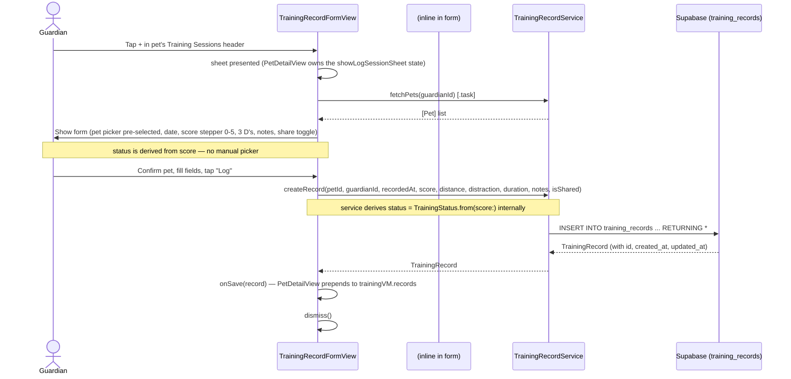
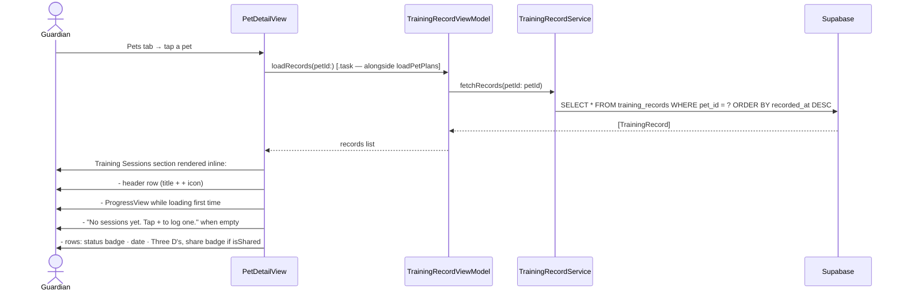
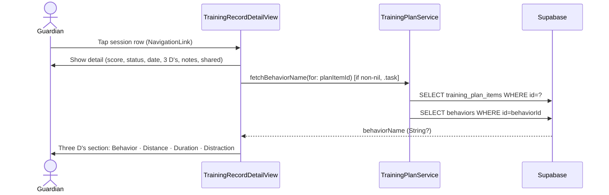
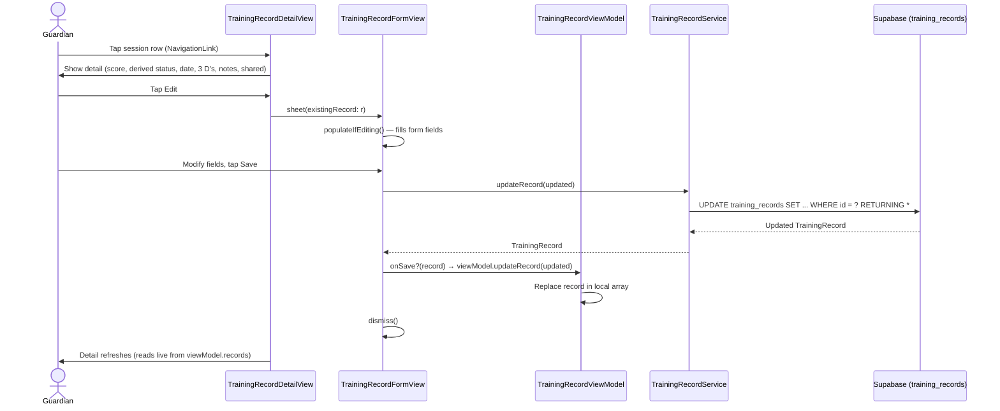
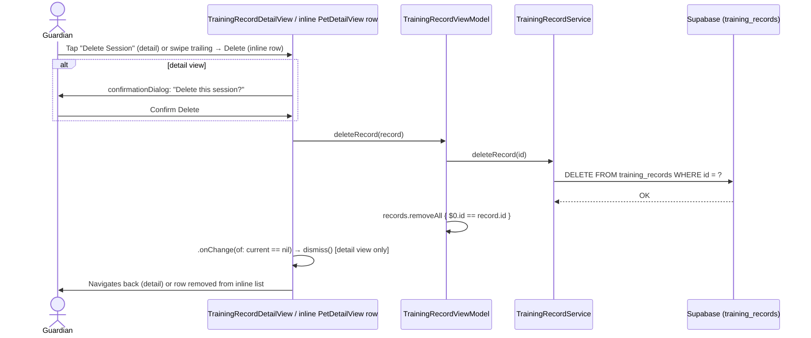

# Use Case: Training Record Logging (Phase 4)

## UC-4.1 Log a Training Session

Guardian taps the **+** button in the **Training Sessions** header on the Pet detail screen, fills in the form, and saves. The record is persisted to Supabase and appears inline in the list immediately. Sessions can also be logged via the Plans flow (see UC-9.6).

There is no standalone Log tab and no standalone sessions list screen. All standalone session logging is initiated from the Pets tab (Pet Detail → Training Sessions section's `+` icon).

---

## UC-4.2 View Training Sessions List (IOS-20)

Sessions are rendered **inline** on `PetDetailView` under the **Training Sessions** section header (matching the Plans header style — left-aligned bold title with a trailing `+` icon). The previous standalone `TrainingRecordListView` has been removed; `PetDetailView` owns its own `TrainingRecordViewModel` instance and pulls records directly.

### Section behavior

- **Pull-to-refresh** on the Pet detail List reloads both plans (`loadPetPlans`) and sessions (`trainingVM.loadRecords`).
- **Tap a row** → `NavigationLink(value: record)` pushes `TrainingRecordDetailView` onto the Pet detail's `NavigationStack` (not a sheet). Registered via `.navigationDestination(for: TrainingRecord.self)` on `PetDetailView`.
- **Swipe-leading**: toggle sharing (`trainingVM.toggleSharing`), label flips between "Share" and "Unshare".
- **Swipe-trailing**: destructive Delete (`trainingVM.deleteRecord`).
- Errors from the training VM surface through `PetDetailView`'s alert binding.

### Why the body is a `List`

The container changed from `ScrollView { VStack { ... } }` to `List` so the inlined records can use native `.swipeActions` (which only work on List rows). The hero photo and plans section preserve their custom-card appearance via `.listRowInsets(EdgeInsets())` + `.listRowSeparator(.hidden)` + `.listRowBackground(Color.clear)`.

---

## UC-4.3 View a Training Session Detail

Guardian taps a session row. For plan-linked sessions (`planItemId` non-nil), the detail view self-loads the behavior name and shows it in the Three D's section.

Standalone sessions (`planItemId` nil) show no Behavior row.

The sharing section (Share with Trainer toggle / "Shared with Trainer" label) is hidden entirely for plan-linked sessions — sharing is controlled once at the plan level via `GuardianPlanDetailView` and inherited by all sessions logged under that plan.

---

## UC-4.3b Edit a Training Session

Guardian taps a session row → detail view → taps **Edit**.

---

## UC-4.4 Delete a Training Session

Guardian can delete from the detail view (button + confirmation dialog) or via swipe-to-delete in the list.

**Note:** swipe-to-delete on the inline list does NOT show a confirmation dialog — the swipe + tap on Delete is itself the confirmation, matching iOS list-swipe conventions. Only the detail view's explicit Delete button confirms.

---

## Test Flow

### T-4.1 Log a new session
1. Build and run the app.
2. Go to **Pets** tab → tap a pet → scroll to the **Training Sessions** section → tap the `+` icon in that section's header.
3. Confirm the pet is pre-selected in the picker.
4. Confirm the **Reps out of 5** stepper is shown (not a manual status picker) — the derived status (coloured circle + label) should update live as you adjust the score.
5. Set score to 5 — confirm status shows Green. Set score to 1 — confirm status shows Red.
6. Set distance / distraction / duration.
7. Scroll down — confirm a **Notes** text field and a **Share with Trainer** toggle are visible at the bottom of the form. (The toggle is hidden for plan-linked sessions — sharing is controlled at the plan level.)
8. Tap **Log** — sheet should dismiss and the new session should appear immediately at the top of this pet's inline Training Sessions list.
9. In Supabase → Table Editor → `training_records`: confirm a new row appears with the correct `pet_id`, `guardian_id`, `score`, and `status` (derived) field values. `plan_item_id` should be `null` for a standalone session.

### T-4.2 View sessions — per pet
1. Go to **Pets** tab → tap a pet.
2. Scroll to the **Training Sessions** section (below Plans).
3. Confirm only sessions for that pet are shown (no other pets' sessions visible).
4. Confirm the row shows: status badge, date/time, distance · distraction · duration, plus a person-2 icon when shared.

### T-4.3b Empty state
1. Add a second pet with no sessions.
2. Go to **Pets** → tap that pet.
3. Confirm the inline copy "No sessions yet. Tap + to log one." appears below the Training Sessions header. (No large empty-state component.)

### T-4.3 View a plan-linked session detail
1. Complete a plan step (UC-9.6) to create a plan-linked session.
2. Go to **Pets** tab → tap the pet → tap the session row in the Training Sessions list.
3. Confirm the detail view **pushes** onto the Pet detail's NavigationStack (back-swipes to Pet detail, not a sheet dismissal).
4. Confirm the **Three D's** section shows a **Behavior** row at the top (e.g. "Behavior: Leave It") above Distance, Duration, Distraction.
5. Open a standalone session (no plan context) — confirm no Behavior row is shown.

### T-4.4 Edit a session
1. Tap a session row to push the detail view.
2. Confirm all fields display correctly.
3. Tap **Edit** — the Edit Session sheet should appear with all fields pre-populated, including the score stepper.
4. Change the score (e.g. 5 → 3) and tap **Save** — the derived status should update (Green → Yellow).
5. Confirm the detail view reflects the updated score and status immediately (no reload required).
6. Confirm the Supabase row is updated.

### T-4.5 Delete from detail view
1. Open a session's detail view (from either the Home tab feed or a pet's inline Training Sessions list).
2. Tap **Delete Session** — confirm a confirmation dialog appears ("Delete this session?").
3. Tap **Delete** — view should dismiss and the row should be gone from the originating list.
4. Confirm the Supabase row is deleted.

### T-4.6 Swipe actions on the inline list
Swipe-leading and swipe-trailing actions are available on each row of the Pet detail's inline Training Sessions list. (The **Home** tab feed also supports swipe-to-delete.)
1. On the inline list, swipe LEFT (trailing) on a row → tap **Delete** → row removed without a confirmation dialog. Supabase row is deleted.
2. On the inline list, swipe RIGHT (leading) on a row → tap **Share** (or **Unshare** if already shared) → `is_shared` toggles. Row updates with/without the person-2 badge.

### T-4.7 Log from Pet Detail (pre-selected pet)
1. Go to **Pets** → tap a pet → tap the `+` icon in the Training Sessions header.
2. Confirm the pet picker pre-selects the correct pet.
3. Log the session and confirm it appears in both this pet's inline list and the **Home** tab feed.

### T-4.8 Pull-to-refresh on Pet detail
1. Open a pet with both plans and sessions.
2. Pull down on the Pet detail screen to refresh.
3. Confirm both the Plans section and the Training Sessions section reload (no error; counts unchanged unless the DB changed).
