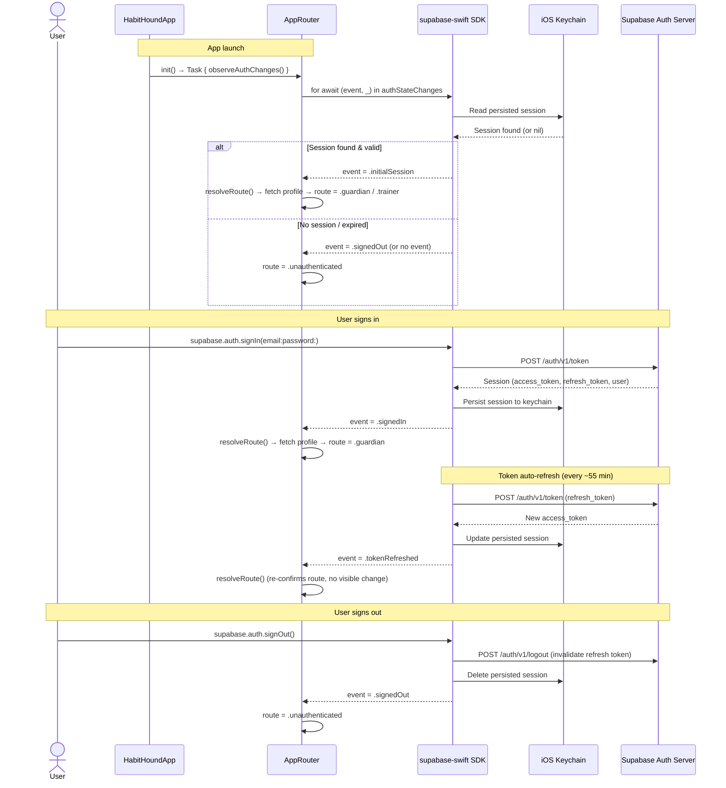

# Session State in HabitHound

## What is session state?

When a user signs in, Supabase returns a **session** — a bundle containing:

| Field | What it is |
|-------|-----------|
| `access_token` | A JWT (JSON Web Token) the app sends with every API request to prove identity |
| `refresh_token` | A long-lived token used to get a new access token when the current one expires |
| `user` | The `auth.users` row for the signed-in user (id, email, created_at, last_sign_in_at, etc.) |
| `expires_at` | When the access token expires (default: 1 hour) |

Supabase automatically **persists** this session to the device's keychain. This means:
- The user stays signed in across app restarts
- The SDK silently refreshes the access token before it expires (triggers a `tokenRefreshed` event)
- `supabase.auth.currentUser` is available **synchronously** in memory — no network call needed

---

## Where session state lives

```
Supabase Auth server
      │
      │  (access token, refresh token, user)
      ▼
supabase-swift SDK  ←──── persisted to iOS Keychain
      │
      ├── supabase.auth.currentUser       ← in-memory, synchronous, nullable
      ├── supabase.auth.currentSession    ← in-memory, synchronous, nullable
      └── supabase.auth.authStateChanges  ← async stream of auth events
```

The SDK is the single source of truth. Our app reads from it but never stores the session itself.

---

## How `currentUser` is used in HabitHound

Throughout the app, every data fetch guards on the signed-in user's ID:

```swift
// DashboardViewModel.swift:16
guard let userId = supabase.auth.currentUser?.id else { return }
```

This is intentional. It means:
- If the session has expired and the token refresh failed, `currentUser` becomes `nil` and the fetch is skipped gracefully.
- The `userId` (a `UUID`) becomes the `guardian_id` filter on every Supabase query, enforcing that users only see their own data — even before RLS runs on the server.

The same pattern appears in every ViewModel and Service in the app.

---

## How AppRouter reacts to session changes

`AppRouter` is the only place in the app that *listens* to auth state changes. Everything else just reads `currentUser` on demand.



---

## Auth events and what they mean

| Event | When it fires | AppRouter response |
|-------|--------------|-------------------|
| `initialSession` | App launched with a valid session already in keychain | `resolveRoute()` |
| `signedIn` | `signIn()` or `signUp()` completed successfully | `resolveRoute()` |
| `tokenRefreshed` | SDK silently refreshed the access token | `resolveRoute()` (no-op in practice) |
| `userUpdated` | Profile fields changed on the server | `resolveRoute()` |
| `signedOut` | `signOut()` called, or server invalidated the session | `route = .unauthenticated` |
| `userDeleted` | Account deleted on the server | `route = .unauthenticated` |

---

## Why `currentUser` can be nil

`supabase.auth.currentUser` is `nil` when:
1. The user has never signed in on this device
2. The user signed out
3. The access token expired **and** the refresh attempt failed (e.g., no network, or the refresh token was revoked server-side)

Case 3 is the tricky one. The SDK handles it automatically — it fires a `signedOut` event and clears the keychain — but there's a brief window between the token expiring and the refresh attempt completing. Our `guard let userId = supabase.auth.currentUser?.id else { return }` pattern handles this gracefully by simply not making the request.

---

## Access tokens and RLS

The `access_token` is a JWT that contains the user's `sub` (subject) claim — which is their UUID. Supabase appends this JWT to every HTTP request the SDK makes. On the server, Postgres reads it via `auth.uid()` to enforce Row Level Security policies:

```sql
-- Example RLS policy on training_records
CREATE POLICY "guardian_own_records" ON training_records
  FOR ALL USING (guardian_id = auth.uid());
```

This means even if the app code has a bug and forgets to filter by `userId`, the database will still only return that user's rows. The app-level guard is a first line of defence; RLS is the enforced boundary.
