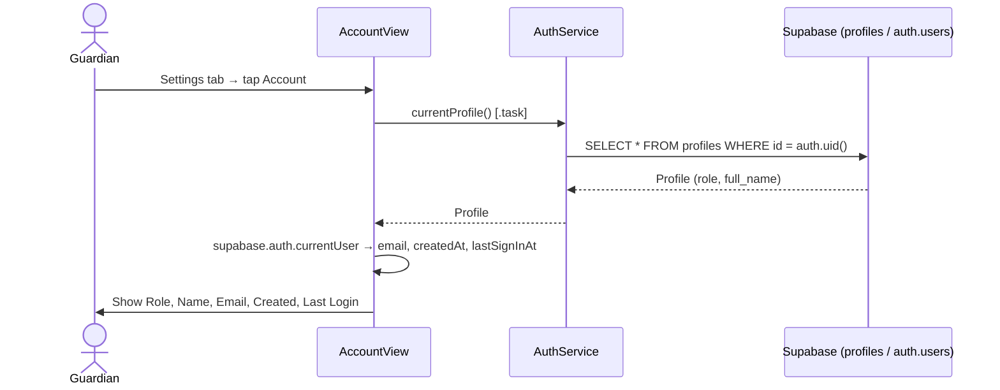
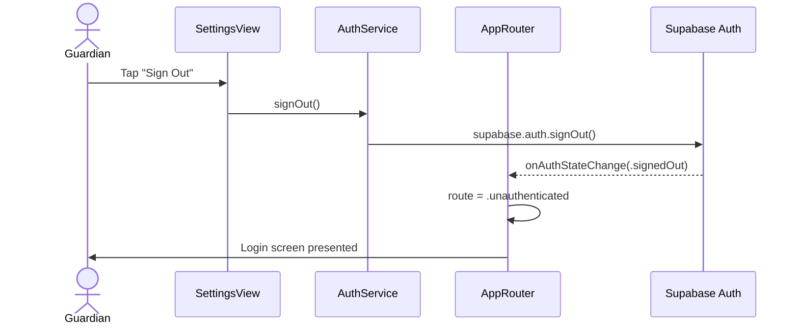
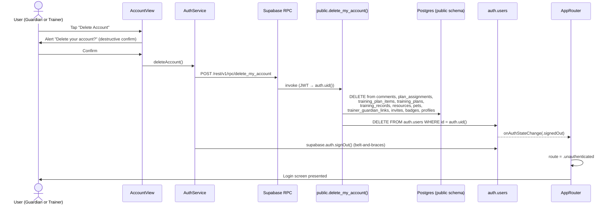

# Use Case: Settings & Account (Phase 4.5)

## UC-S.1 View Account Information

Guardian navigates to **Settings → Account** to view their profile and auth details.

---

## UC-S.2 Sign Out

Guardian taps **Sign Out** in Settings. `AppRouter` listens to `onAuthStateChange` and automatically routes to the login screen — no explicit navigation needed.

---

## UC-S.3 Delete Account

Required by Apple App Store Guideline 5.1.1(v): any app that supports account creation must let users initiate permanent account deletion from within the app.

User taps **Settings → Account → Delete Account**. The client cannot delete from `auth.users` directly (that requires the `service_role` key, which must never ship in the app), so deletion is performed by a Postgres function with `SECURITY DEFINER` that runs with elevated privileges.

### Storage cleanup
Storage objects (pet photos, resource images, avatars) are intentionally **not** deleted by the function — Postgres cannot call the Storage API directly. Objects live in private buckets keyed by user UUID and are unreachable once the owning `auth.user` is gone. A periodic cleanup job can sweep orphans later. Apple's deletion requirement applies to the account and its data visible through the app, which is satisfied.

### Security posture
- Function declared `SECURITY DEFINER` with `SET search_path = public, auth` to prevent search-path hijacking.
- `REVOKE ALL FROM public` + `GRANT EXECUTE TO authenticated` — only signed-in users can invoke it, and only for their own `auth.uid()`.
- No parameters — the target user is always `auth.uid()`, so a caller cannot delete another user's account.

---

## Test Flow

### T-S.1 View account info
1. Go to the **Settings** tab.
2. Confirm the list shows an **Account** row and a **Sign Out** button.
3. Tap **Account**.
4. Confirm Role, Name, and Email match the signed-in user.
5. Confirm Created and Last Login dates are present and plausible.

### T-S.2 Sign out
1. From the **Settings** tab, tap **Sign Out**.
2. Confirm the app returns to the login screen immediately (no confirmation dialog — the action is reversible).
3. Sign back in and confirm the app returns to the Guardian Home tab.

### T-S.3 Delete account
1. Create a throwaway account (e.g. `temp@jones.com`) and seed it with a pet + one training record so deletion has something to cascade through.
2. Settings → Account → scroll to the **Delete Account** section.
3. Confirm the destructive button and its explanatory footer are visible.
4. Tap **Delete Account** → the confirmation alert appears.
5. Tap **Cancel** → confirm nothing changes.
6. Tap **Delete Account** again → confirm in the alert.
7. Confirm the button shows a "Deleting…" spinner while the RPC runs.
8. Confirm the app returns to the login screen automatically.
9. In Supabase Dashboard → Authentication → Users, confirm the row is gone.
10. Run `SELECT count(*) FROM pets WHERE guardian_id = '<deleted user id>'` → should return 0. Repeat for `training_records`, `profiles`, etc.
11. Try to sign in again with the deleted credentials → should fail with "Invalid login credentials."
