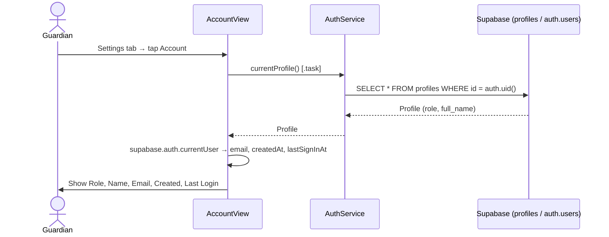
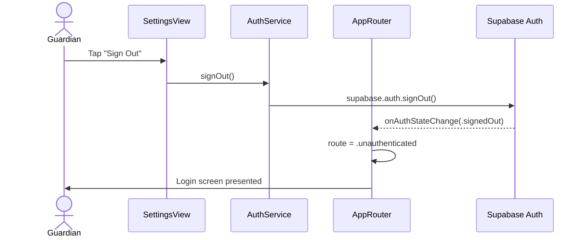

# Use Case: Settings & Account (Phase 4.5)

## UC-S.1 View Account Information

Guardian navigates to **Settings → Account** to view their profile and auth details.

---

## UC-S.2 Sign Out

Guardian taps **Sign Out** in Settings. `AppRouter` listens to `onAuthStateChange` and automatically routes to the login screen — no explicit navigation needed.

---

## Test Flow

### T-S.1 View account info
1. Go to the **Settings** tab.
2. Confirm the list shows an **Account** row and a **Sign Out** button.
3. Tap **Account**.
4. Confirm Role, Name, and Email match the signed-in user.
5. Confirm Created and Last Login dates are present and plausible.

### T-S.2 Sign out
1. From the **Settings** tab, tap **Sign Out**.
2. Confirm the app returns to the login screen immediately (no confirmation dialog — the action is reversible).
3. Sign back in and confirm the app returns to the Guardian Home tab.
