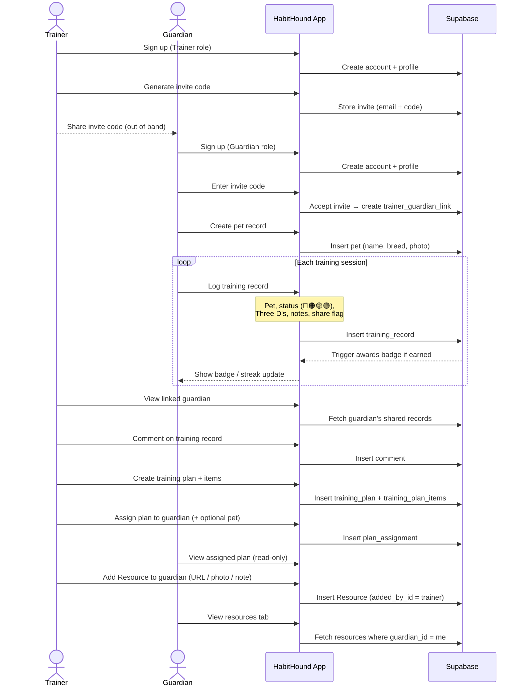

# Use Case - SignUp

## Sequence Diagram

```mermaid
sequenceDiagram
    actor T as Trainer
    actor G as Guardian
    participant App as HabitHound App
    participant DB as Supabase

    %% Onboarding
    T->>App: Sign up (Trainer role)
    App->>DB: Create account + profile
    T->>App: Generate invite code
    App->>DB: Store invite (email + code)
    T-->>G: Share invite code (out of band)

    G->>App: Sign up (Guardian role)
    App->>DB: Create account + profile
    G->>App: Enter invite code
    App->>DB: Accept invite → create trainer_guardian_link

    %% Pet setup
    G->>App: Create pet record
    App->>DB: Insert pet (name, breed, photo)

    %% Training loop
    loop Each training session
        G->>App: Log training record
        Note over App: Pet, status (🔴🟠🟡🟢),<br/>Three D's, notes, share flag
        App->>DB: Insert training_record
        DB-->>App: Trigger awards badge if earned
        App-->>G: Show badge / streak update
    end

    %% Trainer reviews
    T->>App: View linked guardian
    App->>DB: Fetch guardian's shared records
    T->>App: Comment on training record
    App->>DB: Insert comment

    %% Training plan
    T->>App: Create training plan + items
    App->>DB: Insert training_plan + training_plan_items
    T->>App: Assign plan to guardian (+ optional pet)
    App->>DB: Insert plan_assignment
    G->>App: View assigned plan (read-only)

    %% Resources
    T->>App: Add Resource to guardian (URL / photo / note)
    App->>DB: Insert Resource (added_by_id = trainer)
    G->>App: View resources tab
    App->>DB: Fetch resources where guardian_id = me
```
