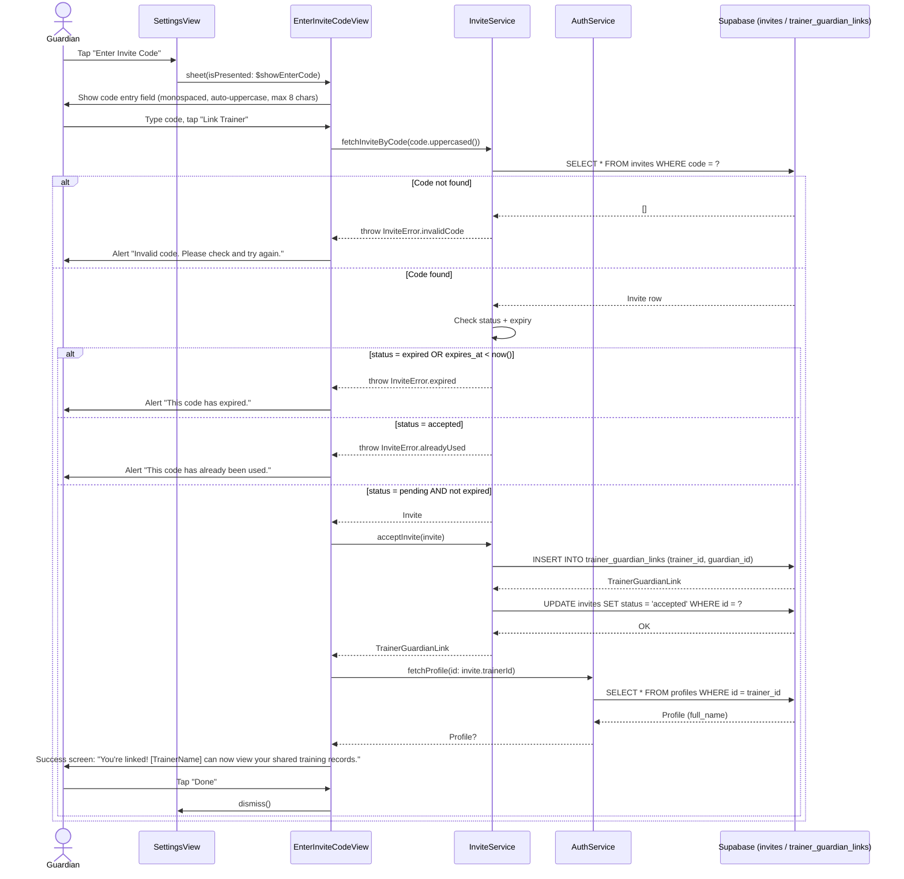
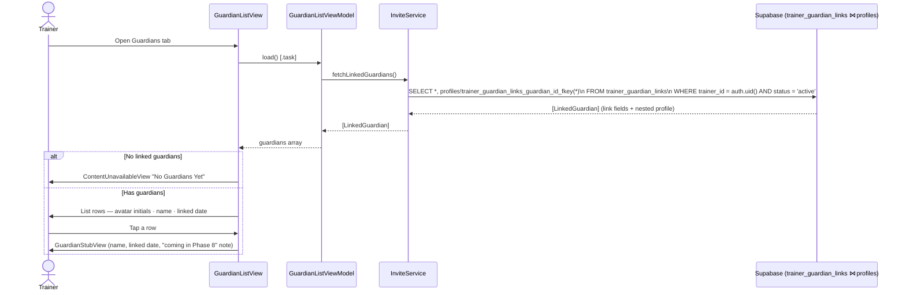

# Use Case: Trainer Invite & Guardian Linking (Phase 7)

## What is the invite/link system?

By default, Guardians and Trainers are completely isolated — a Trainer cannot see any Guardian's pets or training records. The invite system creates a **trusted relationship** between them.

The flow is asymmetric on purpose:

| Step | Actor | Action |
|------|-------|--------|
| 1 | Trainer | Generates an invite code for a Guardian's email address |
| 2 | Trainer → Guardian | Shares the 8-character code (by email, or out of band) |
| 3 | Guardian | Enters the code in Settings → "Enter Invite Code" |
| 4 | System | Creates a `trainer_guardian_links` row and marks the invite `accepted` |
| 5 | Trainer | Can now see the Guardian in their Guardians list and read shared records |

The **invite** is ephemeral (expires in 7 days, single-use). The **link** is the durable record of the relationship. All cross-role data access is gated on the link existing and being `active`.

---

## Where state lives

```
invites table
  id · trainer_id · email · code · status · created_at · expires_at
        │
        │ Guardian enters code → acceptInvite()
        ▼
trainer_guardian_links table
  id · trainer_id · guardian_id · status · linked_at
        │
        │ Supabase RLS checks this table on every cross-role query
        ▼
pets / training_records (is_shared = true)  ← now visible to Trainer
```

---

## UC-7.1 Trainer Sends an Invite

Trainer enters a Guardian's email in the **Invite** tab and taps **Send Invite**. An `invites` row is created and a best-effort email is dispatched via Edge Function.

```mermaid
sequenceDiagram
    actor T as Trainer
    participant IV as InviteView
    participant IVM as InviteViewModel
    participant SVC as InviteService
    participant DB as Supabase (invites)
    participant EF as Edge Function (send-invite-email)
    participant EM as Resend (email)

    T->>IV: Enter email, tap "Send Invite"
    IV->>IVM: sendInvite(trainerName:)
    IVM->>SVC: createInvite(email:, trainerName:)
    SVC->>SVC: generateCode() → 8-char alphanumeric
    SVC->>DB: INSERT INTO invites (trainer_id, email, code) RETURNING *
    DB-->>SVC: Invite (id, code, status=pending, expires_at=+7days)
    SVC-->>IVM: Invite

    SVC->>EF: invoke("send-invite-email", {email, code, trainerName}) [fire-and-forget Task]
    EF->>EM: POST /emails (HTML with code + instructions)
    EM-->>EF: 200 OK
    Note over SVC,EM: Email failure does NOT block invite creation

    IVM->>IVM: invites.insert(invite, at: 0); sentCode = invite.code; email = ""
    IV->>T: Show code banner (32pt monospaced) + Copy Code button
    IV->>T: Show invite in "Sent Invites" list with status badge
```

### Code generation

`generateCode()` in `InviteService` produces an 8-character code from a charset that deliberately omits visually ambiguous characters:

```swift
// InviteService.swift
let chars = "ABCDEFGHJKLMNPQRSTUVWXYZ23456789"  // no O, 0, I, 1
return String((0..<8).map { _ in chars.randomElement()! })
```

This gives 32⁸ ≈ 1 trillion possible codes. Codes are stored and compared uppercased.

---

## UC-7.2 Guardian Enters Invite Code

Guardian goes to **Settings → Enter Invite Code**, types the 8-character code, and taps **Link Trainer**. On success, a `trainer_guardian_links` row is created and the invite is marked `accepted`.



### What the Guardian sees in the code entry field

- Auto-uppercases as typed (`textInputAutocapitalization(.characters)`)
- Clamped to 8 characters max (`.onChange` trims excess)
- **Link Trainer** button disabled until exactly 8 characters are entered
- Monospaced font for readability

### What "linked" actually enables

Once `trainer_guardian_links` has an `active` row, two RLS policies on the database allow read access:

```sql
-- pets: trainer can SELECT guardian's pets
CREATE POLICY "Linked trainer can view guardian pets"
    ON public.pets FOR SELECT USING (
        EXISTS (
            SELECT 1 FROM trainer_guardian_links tgl
            WHERE tgl.trainer_id  = auth.uid()
              AND tgl.guardian_id = pets.guardian_id
              AND tgl.status      = 'active'
        )
    );

-- training_records: trainer can SELECT shared records only
CREATE POLICY "Linked trainer can view shared training records"
    ON public.training_records FOR SELECT USING (
        is_shared = true
        AND EXISTS (
            SELECT 1 FROM trainer_guardian_links tgl
            WHERE tgl.trainer_id  = auth.uid()
              AND tgl.guardian_id = training_records.guardian_id
              AND tgl.status      = 'active'
        )
    );
```

The Guardian controls visibility per-record via the **Share with Trainer** toggle in the training log form. A record with `is_shared = false` is never visible to the Trainer, even if a link exists.

---

## UC-7.3 Trainer Views Linked Guardians

Trainer opens the **Guardians** tab. A list of all linked Guardians is shown; tapping one opens a stub detail view (full detail coming in Phase 8).



### The `LinkedGuardian` join type

`fetchLinkedGuardians()` uses Supabase's PostgREST embed syntax to return the link row and the Guardian's profile in a single query. The Swift type that decodes it:

```swift
// InviteService.swift
struct LinkedGuardian: Identifiable, Decodable, Hashable {
    let id: UUID          // trainer_guardian_links.id
    let trainerId: UUID
    let guardianId: UUID
    let status: LinkStatus
    let linkedAt: Date
    let profile: Profile  // decoded from the nested "profiles" key

    enum CodingKeys: String, CodingKey {
        // ...
        case profile = "profiles"   // matches PostgREST embed key name
    }
}
```

The query uses the FK name to disambiguate which join to use (the `trainer_guardian_links` table has two FK references to `profiles`):

```swift
.select("*, profiles!trainer_guardian_links_guardian_id_fkey(*)")
```

---

## Edge cases

| Scenario | Behaviour |
|----------|-----------|
| Code entered with wrong case | Auto-uppercased by the text field; `fetchInviteByCode` also calls `.uppercased()` as a safety net |
| Code expired (> 7 days old) | Status check in `fetchInviteByCode` throws `.expired` even if DB status is still `pending` |
| Code already used | `status = accepted` → throws `.alreadyUsed` |
| Guardian already linked to this trainer | `UNIQUE(trainer_id, guardian_id)` constraint on the table causes the INSERT to fail with a DB error |
| Email fails to send | The `send-invite-email` invocation is in a `fire-and-forget Task` with `try?` — failure is silently swallowed. The invite row is still created and the code is shown in the UI for manual sharing. |
| Trainer is not signed in | `supabase.auth.currentUser?.id` is `nil` → `createInvite` throws `InviteError.notAuthenticated` |

---

## Test Flow

### T-7.1 Trainer sends an invite
1. Sign in as a Trainer. Go to the **Invite** tab.
2. Enter a valid email address and tap **Send Invite**.
3. Confirm a monospaced code banner appears with a **Copy Code** button.
4. Confirm the invite appears in the **Sent Invites** list with a yellow **Pending** badge.
5. In Supabase → `invites` table: confirm a row exists with `status = pending`, `code` matching what was shown, and `expires_at` roughly 7 days from now.
6. Check the email inbox — confirm an email arrived with the correct code and trainer name.

### T-7.2 Guardian redeems a valid code
1. Sign in as a Guardian (different account). Go to **Settings → Enter Invite Code**.
2. Enter the code from T-7.1. Tap **Link Trainer**.
3. Confirm the success screen shows the **Trainer's name** (not the Guardian's own name).
4. Tap **Done** — sheet dismisses.
5. In Supabase → `invites`: confirm `status = accepted`.
6. In Supabase → `trainer_guardian_links`: confirm a row exists with correct `trainer_id` and `guardian_id`, `status = active`.

### T-7.3 Trainer sees the linked Guardian
1. Switch back to the Trainer account. Open the **Guardians** tab.
2. Confirm the Guardian appears in the list with their name and linked date.
3. Tap the row — confirm the stub detail view opens showing name and linked date.

### T-7.4 Invalid code
1. As a Guardian, open **Settings → Enter Invite Code**.
2. Enter `XXXXXXXX` (a code that doesn't exist). Tap **Link Trainer**.
3. Confirm an alert appears: "Invalid code. Please check and try again."

### T-7.5 Expired code
1. In Supabase, manually set a pending invite's `expires_at` to a past timestamp.
2. As a Guardian, enter that invite's code.
3. Confirm the alert says "This code has expired."

### T-7.6 Already-used code
1. Use the same code a second time (after it has been accepted in T-7.2).
2. Confirm the alert says "This code has already been used."

### T-7.7 Shared records visible to Trainer
1. As the Guardian, log a training record with **Share with Trainer** toggled **on**.
2. Log a second record with **Share with Trainer** toggled **off**.
3. As the Trainer (in Phase 8 once GuardianDetailView is built), confirm only the shared record is visible.
4. *(Can also verify directly in Supabase SQL editor using the trainer's JWT.)*
